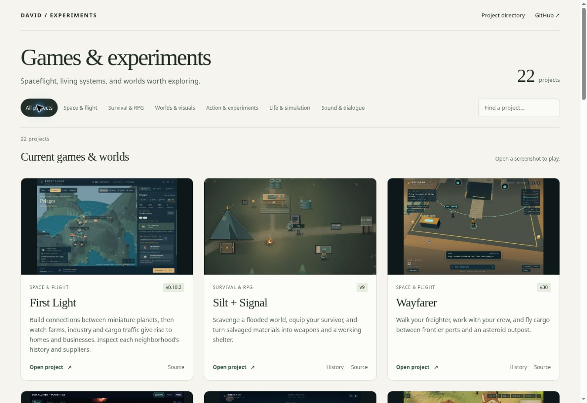

# Gallery verification · 2026-09-28

## Inventory and organization

- `/spaceship/index.html` is a static screenshot gallery for 22 projects.
- The root gallery and generated project directory launch each selected build directly.
- Eight previously unlisted projects now have their own directories: Wreck Run, Star Cluster, Bramblewild, Last Light, Wayfarer Pixel Study, Blackpine, Breach Run and Island Three.
- First Light remains the exact v0.9 portable release in `first-light/`.
- Silt + Signal is updated from saved Sites v3 to confirmed live v9.
- Dedicated external repositories retain their homes. Existing launch redirects and archives are preserved.
- The original Sites projects, sources, URLs and access settings are unchanged.

## Source and runtime checks

- Gallery local links, images, source directories and unique project IDs checked.
- Wayfarer: all 50 runtime files verified, 30 source commits restored.
- Silt + Signal: all 4 runtime files byte-identical to v9; 9 source commits restored; original gameplay/Canvas tests pass.
- First Light: 32 simulation tests pass with its matching installed dependencies; portable runtime hash matches its provenance.
- Star Cluster: 35 simulation tests and the portable HTML check pass; public runtime matches the committed v11 export exactly.
- Wreck Run: standalone bundle compiles; no external runtime assets.
- Bramblewild, Last Light and Pixel Study: local imports and JavaScript syntax checked; original game modules preserved byte-for-byte.
- Blackpine: original standalone HTML preserved byte-for-byte. Breach Run and Island Three: syntax and local dependencies checked.
- External launch links returned HTTP 200. A real Planet Generator module mismatch was repaired in its own repository by pinning three addon imports to its existing Three.js r128 core. Exact core plus transitive addon imports verified successfully.

## Preview provenance and limits

Previews use actual game captures or the exact game renderer, never generated substitute artwork.

- Silt + Signal uses the current v9 Canvas renderer and its existing shelter test scene.
- Wreck Run, Bramblewild, Last Light and Pixel Study use verified captures from their selected versions.
- Star Cluster currently uses a real v10 screenshot of the cluster view. The card explicitly labels the preview v10; its launch opens v11. It does not depict v11’s new terrain relief.
- Blackpine has a fresh v2 gameplay screenshot captured from its public page. Island Three has no current preview; its old v1 screenshot depicts a materially different version and is excluded from the gallery.
- Seven legacy WebGL previews are unavailable in the capture browser: Planetside, Planet Generator, Starmap, Orbital Velocity, Ship effects, ASCII FLIP and Pulsating sphere. The cloud browser cannot create WebGL contexts. Native browser launch was also blocked by the execution environment. These are labeled honestly, with working launch links retained.

Static validation is not a claim of full gameplay, physical-controller, touch-device or audible-audio testing. Post-publication browser checks are recorded below.

## Public verification

GitHub Pages successfully deployed commit `9e54f76e492c699bb32a3686360bd9540b565f73`. All 22 launch URLs and all 13 then-listed screenshot URLs returned HTTP 200. All 23 checks with a corresponding local file matched its bytes exactly. Blackpine’s new current gameplay preview was captured subsequently.

In the live browser, the gallery shows 22 cards without desktop horizontal overflow. The Space & flight filter returns 7 projects; searching First Light returns 1. Its preview link opens the correct public First Light game and compatibility-rendered gameplay appears. Planet Generator’s former Timer module error is gone; it reaches graphics initialization. Narrow-viewport browser/device testing was not available.

All 13 initially published gallery images decoded in the live browser after deferred loading. Blackpine starts and renders current v2 gameplay. Wreck Run’s Quiet tow starts and displays the tug and wreck with the compatibility renderer. Island Three loads its local source/modules and displays its explicit WebGL-required message in this browser; GPU gameplay could not be verified here.

## Island Three v9 preview · 2026-09-30

- Added a real 1280 × 720 screenshot of the unchanged standalone v9 build, source commit `91adfc21e038d4e489327f739e806fc68f2eff25`. The authored Vista uses 12:00 daylight, High rendering quality, paused time/motion and the built-in still refinement. The WebP is an encoding of the browser capture, with no generated or composited artwork.
- Captured in an isolated local Chromium 153 browser with SwiftShader WebGL, using only locally served repository assets. This resolves Island Three’s earlier capture limitation; the cloud browser still cannot render its WebGL scene. The historical v1 capture remains under `source/`.
- Verified decoded 1280 × 720 preview and complete card on 1280-pixel desktop and 390-pixel mobile viewports; no mobile horizontal overflow. Preview, title and Open project links retain `island-three/`.
- Existing standalone checks pass. All launch URLs, Island Three version/commit fields, runtime, vendor modules, source archive and provenance remain unchanged. All 13 current gallery entries now have previews; seven experiment previews remain unavailable.
- Regenerated gallery and project directory. Existing image cache keys and the stale First Light directory version label were also synchronized with the unchanged catalog entries by the existing generator.

## Projects directory migration · 2026-10-02

- Migrated the 14 spaceship-owned game/study folders to `projects/`, including Nebula Weave outside the gallery. Editable sources, selected releases, previews, provenance and history stay together. Duplicate Inkstar assets were already byte-identical to Inkdrift's archive; that archive retains them and the old entry README.
- Preserved all catalog `launch`, `live` and `versions` URLs. All nine entries belonging to other repositories are unchanged. Owned catalog directories/source links and screenshot paths now point into `projects/`.
- The existing branch-based Pages layout remains rooted at `main` with `.nojekyll`. `pages-redirects.json` and the gallery generator produce 34 relative compatibility pages, covering every prior HTML file as well as the new `projects/` entry. Directory, explicit `index.html`, slashless, nested history/archive, Inkstar, WFC demo and `spaceship_001.html` routes remain available. JavaScript redirects preserve query strings and fragments; canonical/meta-refresh/link fallbacks are present.
- Exporter destinations now come from the owned catalog directory. Regression tests verify subsequent releases cannot overwrite root compatibility pages and reject external/traversing destinations.
- All relocated sources, runtime modules, assets and gameplay HTML are byte-identical to commit `ae6080f14efc656708b5cf1d667de8de810cc86a`. Four non-gameplay archive/about pages have source/navigation-link updates. Provenance hashes still match. Star Cluster's rebuilt portable release is also byte-identical.
- Local HTTP verification passed for all 22 catalog launches (external entries checked at their existing public addresses), 34 compatibility pages and 214 local routes/resources, including directory and slashless forms: 315 requests. All local responses matched the reviewed bytes. Literal module dependencies, import maps, links, images, WFC parts and downloadable history bundles were checked.
- Layout/exporter regression tests, standalone manifest/history restoration checks, First Light's 39 tests and Star Cluster's 36 tests pass. Their exact development dependencies were installed only for testing. Existing whitespace in unchanged runtime files was preserved.
- Route scripts were executed with a browser-shaped `location` object in Node to verify destination and query/fragment behavior. Interactive GPU, sound, controller and touch gameplay were not revalidated in this migration; the local Chromium download was unavailable. This is a source/layout migration of unchanged game builds.
- After publishing, run `python3 scripts/check_pages.py --base https://actiondaveinri.github.io/spaceship/` to verify deployed launch pages and resources against the reviewed checkout.

### Deployed migration verification

GitHub Pages successfully deployed migration commit `c0bdf3da95f973a13326b4133078257a9608951f` in [deployment 37004570316](https://github.com/ActionDaveInRI/spaceship/actions/runs/37004570316). In the live cloud browser, all 13 spaceship-owned gallery launches navigate from their established root URLs to the matching `projects/<game>/index.html` builds. First Light loads its compatibility-rendered interface. A direct old First Light URL with `?seed=123&mode=test#landing-site` retains the complete query and fragment.

Live browser checks also passed for the original Inkstar standalone/fleet URLs, WFC Nebula Demo, `spaceship_001.html`, and Wayfarer/Silt + Signal history pages. The gallery still has 22 cards and uses canonical `projects/` source and screenshot links. Interactive GPU, sound, physical-controller and touch behavior remain outside this migration's validation scope.

The first HTTP sweep began during deployment and encountered one mismatched response for the new `projects/index.html`; fetching that page after deployment confirmed the reviewed bytes. Post-deployment checks were repeated to distinguish deployment propagation from a layout defect.

The completed post-deployment verifier passes all 22 catalog launch URLs and 214 local routes/resources across 315 requests, including all 34 compatibility pages, explicit index files, directory URLs and slashless forms. Responses match the reviewed bytes. GitHub Pages serves `/projects` through the pre-existing `projects.html` redirect and `/projects/` through `projects/index.html`; both reach the gallery. The verifier accepts either response only when the manifest proves the same destination, and the live browser confirmed `/projects` reaches `/spaceship/index.html`. The updated verifier reports progress and collects all failures instead of stopping its report at the first failed URL.

Permanent runtime regression checks follow each game's current provenance so future deliberate releases remain possible; the unchanged-source comparison against the migration baseline was a one-time migration check. Existing launch URLs and external source locations remain covered as compatibility invariants. All 15 layout/exporter regression tests pass after the verifier update.

## Account homepage migration preparation · 2026-10-02

Prepared a full-history account website for `ActionDaveInRI/ActionDaveInRI.github.io`, with the gallery at `/` and collected games at `/projects/<game>/`. All 22 catalog entries and 15 screenshots remain. The nine pre-existing external-repository catalog entries are unchanged; Spaceship becomes its own repository-root demo again.

The prepared compatibility tree restores the exact original Spaceship runtime and preserves all 62 former non-root HTML addresses. Its five tests pass, including 186 JavaScript query/fragment cases. The account-site's 16 layout/exporter tests pass; standalone verification restores 30 Wayfarer and 9 Silt + Signal source commits and validates 54 runtime files.

A paired local HTTP rehearsal passes 218 main-site gallery/resource/launch requests and 183 legacy route/destination requests. The main-site scanner inspects 170 routes/resources and correctly treats other repositories on the same Pages origin as external. Every compatibility destination exists. 306 collection files remain byte-identical; 11 documentation/navigation files change. Editable source files, previews and source-history archives remain intact.

At preparation time, deployment was pending account setup. The completed publication and live checks are recorded below; [MIGRATION.md](MIGRATION.md) describes the current layout, deployment records, verification commands and rollback.

### Account homepage deployed

The new public repository `ActionDaveInRI/ActionDaveInRI.github.io` retains the full imported Git history and publishes `main` from the repository root. Pages successfully deployed account-site commit `3922bae89ac5112bca72421e72f793080db0d037` in [run 37069989078](https://github.com/ActionDaveInRI/ActionDaveInRI.github.io/actions/runs/37069989078). The live homepage passed all 218 HTTP requests, covering 22 catalog launches, 170 local routes/resources and gallery aliases, with exact local-byte comparisons.

Only after that success, `spaceship/main` advanced normally from the verified baseline to `dc583a8ebe64438439797ecb4de46944dd2c8679`. [Pages run 37070324576](https://github.com/ActionDaveInRI/spaceship/actions/runs/37070324576) succeeded. All 183 post-deployment compatibility requests passed: 62 legacy HTML paths, index/directory/slashless variants, 28 canonical targets and both original demo root addresses. The restored root demo is byte-identical to the original. Combined, all **401 live HTTP checks passed**.

In the live browser, the new homepage displays 22 cards, all 15 screenshot images decode, search for First Light returns one result and Space & flight returns seven. The desktop has no horizontal overflow. Clicking the First Light screenshot opens `/projects/first-light/` and displays its compatibility-rendered interface. The old First Light URL preserves `?seed=123&mode=test#landing-site` at the new destination. Inkstar, its fleet archive, WFC, Wayfarer and Silt + Signal histories, and both `/spaceship/projects` forms navigate to their intended new locations. The root `/spaceship/` has the original demo title.

This migration leaves the nine previously external repository entries unchanged and moves no source from those repositories. Game source, selected builds, previews and history bundles remain intact. Interactive GPU/audio/controller/touch gameplay was not revalidated; the move changes layout and navigation rather than gameplay.
